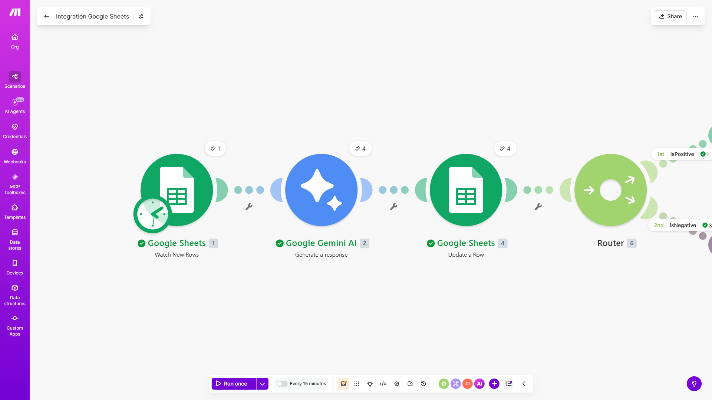
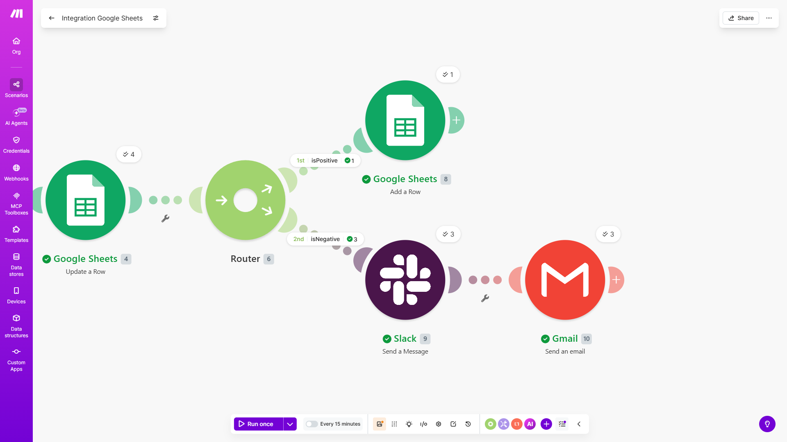

# Sistema de Análisis Automático de Reseñas

Este proyecto automatiza la clasificación y gestión de reseñas de clientes utilizando Machine Learning e integración de servicios (Make.com).

## 🚀 Cómo funciona

El sistema consta de dos componentes principales:

1. **Modelo de Análisis de Sentimientos:** Un modelo entrenado en Python (Regresión Logística + TF-IDF) utilizando el dataset de IMDB. Es capaz de clasificar textos en reseñas `positivas` o `negativas` con más de un 85% de exactitud.

2. **Flujo de Automatización:** Un escenario en Make.com que detecta nuevas reseñas en Google Sheets, procesa el texto mediante Inteligencia Artificial (Gemini) para extraer el sentimiento, y enruta la información. Si la reseña es negativa, dispara alertas automáticas por correo (Gmail) y mensajería (Slack) al equipo de soporte.

## 🛠️ Cómo reproducirlo

1. **Modelo ML:** Abrir el archivo `notebook_clasificador.ipynb` en Google Colab o Jupyter Notebook. Ejecutar las celdas para instalar la librería `datasets`, descargar la muestra aleatoria y visualizar las métricas y la matriz de confusión.
2. **Flujo de Make:** - Crear un webhook/trigger conectado a una hoja de Google Sheets.
   - Conectar un módulo de Google Gemini para clasificar el texto.
   - Implementar un Router con filtros: un camino para "Positivo" (registro en base de datos) y otro para "Negativo" (Notificación en Slack y envío de email mediante módulo de Gmail).

## 📸 Capturas del Flujo

